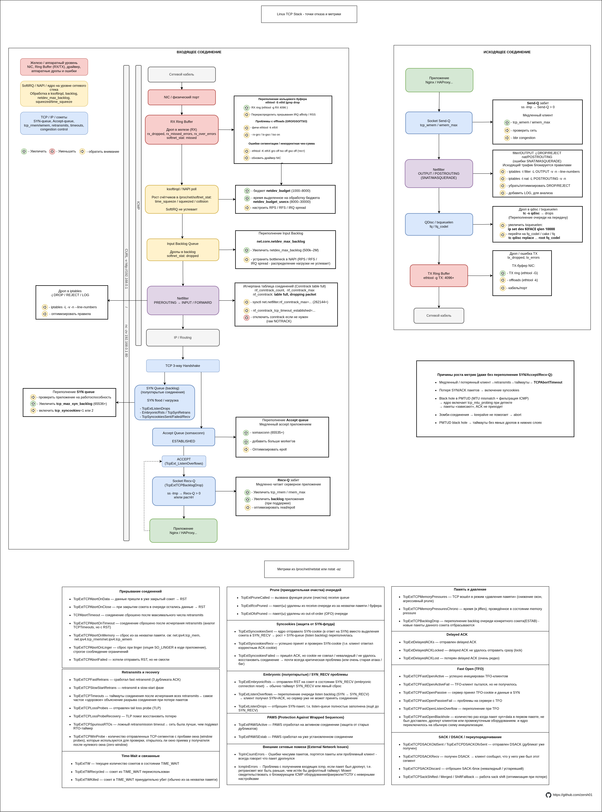

# Linux TCP Queues and Metrics

Детальная схема пути TCP-соединений в ядре Linux: входящий и исходящий трафик, очереди, причины дропов, метрики TcpExt, netfilter hooks, conntrack и точки тюнинга.

## Основные элементы схемы
- **Входящее соединение**: NIC → RX Ring Buffer → Netfilter (PREROUTING/INPUT) → SYN Queue → Accept Queue → accept() → приложение
- **Исходящее соединение**: приложение → send() → TX Queue → Netfilter (OUTPUT/POSTROUTING) → NIC
- **Ключевые очереди и bottlenecks**:
  - RX / TX Ring (ethtool -g)
  - net.core.netdev_max_backlog
  - TCP SYN Queue (tcp_max_syn_backlog)
  - TCP Accept Queue (somaxconn)
  - conntrack table overflow
- **Метрики**: TcpExt_* из /proc/net/netstat (ExtStats, ListenOverflows, ListenDrops, TCPBacklogDrop и др.)
- **Причины дропов и retransmits**: timeouts, memory pressure, TFO, SACK, PAWS и т.д.

Схема создана для быстрого понимания и отладки high-load TCP-серверов (Nginx, HAProxy, Envoy и аналогичных).

## Как использовать
- Скачайте PNG/SVG для презентаций, статей, Telegram-каналов или документации.
- Рекомендуется открывать в полноэкранном режиме или масштабировать (особенно SVG).

## Многоязычная поддержка
- Русский — основной (README.md + схема tcp-stack-ru.png)
- English — README_EN.md + заготовка tcp-stack-en.png
- На будущее: можно добавить схему на других языках (CN, DE и т.д.) в images/ и отдельные README_*.md

## Лицензия
Creative Commons Attribution-ShareAlike 4.0 International (CC BY-SA 4.0)  
Вы можете копировать, распространять, модифицировать — с указанием автора и под той же лицензией.

## Автор
zersh01  

Связанные проекты:
- [iptables_interactive_scheme](https://github.com/zersh01/iptables_interactive_scheme) — интерактивная схема iptables/netfilter
